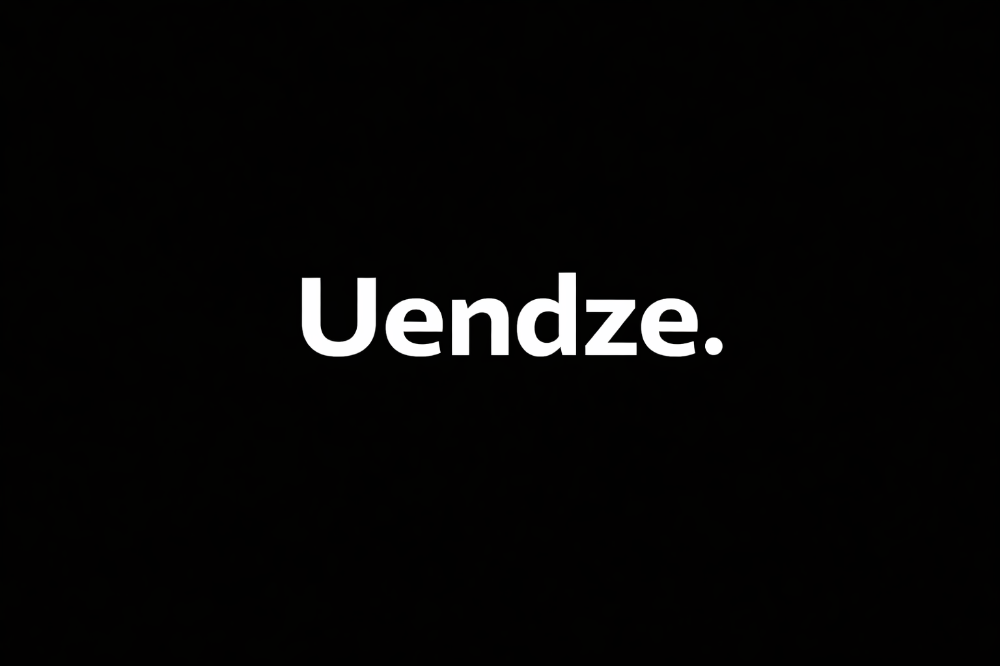

<div align="center">


# **Uendze:Plataforma de Dados Financeiros do Mercado Angolano**


<br />


</div>

---

## **O que é a Uendze?**

A **Uendze** é uma plataforma de **dados financeiros** focada no **mercado angolano**, criada para resolver um problema central:

>  A inexistência de **dados financeiros estruturados, padronizados e acessíveis via API** em Angola.

O projeto nasce com uma abordagem **API-first**, servindo como infraestrutura base para desenvolvedores, analistas, startups e fintechs.

O projeto está atualmente em fase de MVP (Produto Mínimo Viável) e tem como objetivo validar a base técnica e o modelo de dados antes de expandir funcionalidades e cobertura.


<br />

<p align="center">
 
</p>

<br />

> A Uendze está a ser desenvolvido do zero, com foco em modelo de dados correto e crescimento sustentável.

---

## **Público-Alvo**

O Uendze foi desenhado para:

*  **Desenvolvedores** que precisam consumir dados financeiros via API
*  **Analistas de dados e pesquisadores**
*  **Startups e fintechs angolanas**
*  **Estudantes** de tecnologia, economia e finanças

---


## **O Problema**


1.  Dados do mercado Angolano são difíceis de acessar programaticamente
2.  APIs globais têm baixa cobertura regional
3.  Não existem APIs públicas focadas no mercado local
4.  Dados estão dispersos, manuais ou em PDF
5.  Falta histórico estruturado

---

## **A Solução Uendze**

A Uendze resolve isso criando:

>  **camada única de dados financeiros**
>  **modelo de dados consistente**
>  **API REST simples e versionada**
>  **SDKs** para facilitar integrações
>  **Arquitetura pensada para escalar**
>  **Documentação clara**


---

## **Benefícios Principais**

> Simples, direto e útil.

*  Dados financeiros **centralizados** do mercado angolano
*  API REST **simples e previsível**
*  Modelo de dados preparado para **histórico e análises**
*  Menos tempo a coletar dados manualmente
*  Base sólida para produtos financeiros futuros

---

## **Arquitetura (Visão Simplificada)**

```
     Fontes de Dados
            ↓
     Ingestão / ETL
            ↓
      Banco de Dados
            ↓
        API REST
            ↓
        SDKs
            ↓
     Aplicações / Análises
```

Arquitetura pensada para:

* simplicidade
* evolução contínua
* escalabilidade futura

---

## **API – Endpoints (exemplos)**

```http
GET /api/v1/markets
GET /api/v1/markets/{symbol}
GET /api/v1/markets/{symbol}/history?start=YYYY-MM-DD&end=YYYY-MM-DD
```

>  Endpoints serão evoluidos durante o MVP.

---

## **SDKs (em desenvolvimento)**

Além da API REST, a Uendze disponibilizará **SDKs** para facilitar o consumo dos dados.

###  Objetivo dos SDKs

* Eliminar chamadas HTTP manuais
* Reduzir erros de integração
* Aumentar produtividade

### Exemplo — SDK Python (planeado)

```python
from uendze import Client

client = Client(api_key="SUA_API_KEY")

markets = client.markets.list()

history = client.markets.history(
    symbol="BFAAA",
    start="2024-01-01",
    end="2024-01-31"
)
```

>  SDKs serão lançados após estabilização do MVP da API.

---

## **Tecnologias Utilizadas (MVP)**

| Camada         | Tecnologia         |
| -------------- | ------------------ |
| Backend        | Python, FastAPI    |
| ORM            | SQLAlchemy         |
| ETL            | Pandas             |
| Validação      | Pydantic           |
| Banco de Dados | SQLite inicialmente/PostgreSQL(depois)  |
| Infra          |  ainda sem infra   |
| Docs           | OpenAPI (Swagger)  |


---

<div align="center">

**#Praça.**

</div>
